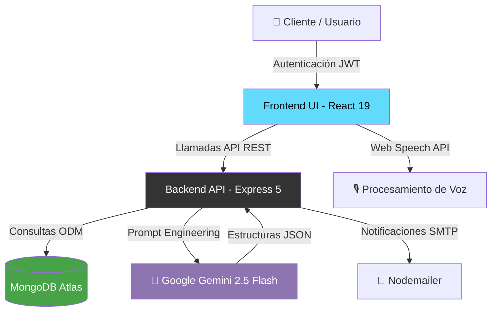

<div align="center">

# 📦 Inventory 360

### Sistema Inteligente de Gestión de Inventario con IA

[](https://nodejs.org/)
[](https://react.dev/)
[](https://www.mongodb.com/)
[](https://ai.google.dev/)
[](https://expressjs.com/)
[](https://vitejs.dev/)

**Inventory 360** es una plataforma SaaS full-stack diseñada para transformar la administración de inventarios mediante la integración de **Inteligencia Artificial (Google Gemini)**. Ofrece automatización de operaciones a través de lenguaje natural (texto y voz), análisis predictivo avanzado y una arquitectura robusta orientada a la escalabilidad empresarial.

[Características](#-características-principales) •
[Arquitectura](#-arquitectura) •
[Instalación](#-instalación-y-configuración) •
[Stack Tecnológico](#-stack-tecnológico) •
[Documentación API](#-api-endpoints)

</div>

---

## ✨ Características Principales

### 🤖 Asistente IA Cognitivo (Voz y Texto)
* **Procesamiento de Lenguaje Natural (NLP):** Ejecución de operaciones complejas mediante instrucciones cotidianas (ej. *"Registra una entrada de 50 unidades de cable UTP"*).
* **Interacción Multimodal:** Soporte nativo para comandos de voz mediante Web Speech API, con síntesis de voz (TTS) para retroalimentación auditiva.
* **Gestión de Contexto:** Memoria conversacional persistente en MongoDB, permitiendo flujos de trabajo multi-turno sin pérdida de información.
* **Motor de Búsqueda Inteligente:** Resolución automática de discrepancias léxicas, sinónimos y plurales para una identificación precisa del catálogo.

### 📊 Business Intelligence & Analytics
* **Dashboard Ejecutivo:** Monitoreo en tiempo real de KPIs críticos (rotación de inventario, valor del stock, ventas diarias).
* **Predicción de Demanda:** Modelos proyectivos generados por IA que anticipan el comportamiento del stock a 60 días.
* **Sistema de Alertas Tempranas:** Notificaciones automatizadas basadas en umbrales de seguridad dinámicos.
* **Reportes Estratégicos PDF:** Generación instantánea de auditorías de inventario analizadas por IA, exportables para la toma de decisiones.

### 📋 Gestión Avanzada de Inventario (CRUD)
* **Generación Automatizada de SKUs:** Control de nomenclatura estandarizada.
* **Control de Semáforo Logístico:** Indicadores visuales de salud de inventario por ítem.
* **Taxonomía Dinámica:** Creación y asignación de categorías en tiempo real.
* **Edición en Línea:** Modificación ágil de metadatos de producto sin recargar vistas.

### 👥 Control de Acceso Basado en Roles (RBAC)
La plataforma segmenta las capacidades operativas para garantizar la seguridad de la información:

| Módulo Operativo | Administrador | Vendedor / POS |
| :--- | :---: | :---: |
| Dashboard Analítico & BI | ✅ | ❌ |
| Gestión Total de Inventario | ✅ | ❌ |
| Asistente IA Multimodal | ✅ | ✅ |
| Sistema de Punto de Venta (POS) | ❌ | ✅ |
| Generación de Reportes Ejecutivos | ✅ | ❌ |
| Administración de Usuarios | ✅ | ❌ |

---

## 🏗 Arquitectura del Sistema

El proyecto sigue una arquitectura cliente-servidor desacoplada, priorizando la escalabilidad y la separación de responsabilidades.



---

## 🚀 Instalación y Configuración

### Requisitos Previos del Entorno
* **Node.js:** v18.x o superior.
* **Gestor de Paquetes:** npm v9+ o yarn.
* **Base de Datos:** Instancia de MongoDB (Local o Atlas).
* **API Key:** Credenciales válidas de Google Gemini AI.

### 1. Despliegue Local

```bash
# Clonar el repositorio
git clone https://github.com/[TU_ORGANIZACION]/Inventory_360.git
cd Inventory_360

# Instalar dependencias del servidor
npm install

# Instalar dependencias del cliente
cd src/frontend
npm install
cd ../..
```

### 2. Configuración de Variables de Entorno (`.env`)

Crea un archivo `.env` en la raíz del proyecto. **Nunca subas este archivo al control de versiones.**

```env
# ─── Configuración de Base de Datos ───
MONGODB_URI=mongodb+srv://<usuario>:<password>@cluster.mongodb.net/inventory360

# ─── Seguridad y Red ───
JWT_SECRET=<generar_hash_criptografico_seguro>
PORT=3000
CORS_ORIGIN=http://localhost:5173

# ─── Servicios de Inteligencia Artificial ───
GEMINI_API_KEY=<tu_clave_de_api_gemini>

# ─── Servicios de Mensajería (Opcional) ───
SMTP_HOST=smtp.ejemplo.com
SMTP_PORT=587
SMTP_USER=notificaciones@tuempresa.com
SMTP_PASS=<password_de_aplicacion>
```

### 3. Inicialización de Datos (Seeding)

Para propósitos de prueba, inicializa la base de datos con un usuario administrador:

```bash
node src/backend/seed_admin.js
```
> **Nota de Seguridad:** Cambia las credenciales generadas inmediatamente después del primer inicio de sesión en el entorno de producción.

### 4. Arranque del Entorno de Desarrollo

```bash
# Terminal 1: Iniciar el servidor de la API (Backend)
npm run dev

# Terminal 2: Iniciar la interfaz de usuario (Frontend)
cd src/frontend
npm run dev
```

---

## 🔌 Documentación de la API (Endpoints Principales)

El backend expone una API RESTful documentada y protegida mediante JSON Web Tokens.

| Módulo | Endpoint | Método | Descripción | Auth |
| :--- | :--- | :---: | :--- | :---: |
| **Auth** | `/api/auth/login` | `POST` | Emisión de token JWT para sesiones. | ❌ |
| **Auth** | `/api/auth/me` | `GET` | Validación de sesión y perfil activo. | 🔒 |
| **Inventario** | `/api/products` | `GET` / `POST` | Listado y registro de mercancía. | 🔒 |
| **Inventario** | `/api/products/:id` | `PUT` / `DEL` | Mutación de registros de productos. | 🔒 |
| **Inteligencia** | `/api/chat` | `POST` | Procesamiento de intenciones por texto. | 🔒 |
| **Inteligencia** | `/api/dashboard/strategy`| `GET` | Generación de análisis predictivo. | 🔒👑 |
| **Ventas** | `/api/checkout` | `POST` | Procesamiento de carrito y deducción de stock. | 🔒 |

> **Leyenda:** 🔒 = Requiere Token Bearer válido | 👑 = Requiere privilegios de Administrador.

---

## 🧠 Lógica de Integración AI (Gemini 2.5 Flash)

Inventory 360 no utiliza la IA como un simple generador de texto, sino como un **orquestador de intenciones**. El flujo de trabajo se divide en:

1.  **Clasificación y Extracción de Entidades:** El prompt del usuario es evaluado para mapear intenciones (`ADD_PRODUCT`, `UPDATE_STOCK`, etc.) y extraer parámetros clave (cantidades, precios, nombres de productos).
2.  **Resolución Transaccional:** El motor de backend toma el JSON estructurado devuelto por Gemini y ejecuta la operación directa sobre MongoDB, garantizando la integridad referencial y de tipos de datos.

---

<div align="center">

**Desarrollado y mantenido por Luis Enrique De Santiago Colin**
*Ingeniería en Desarrollo de Software Multiplataforma*

</div>
